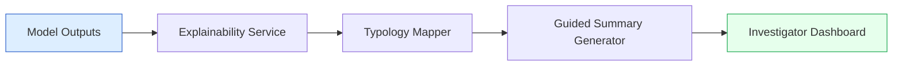
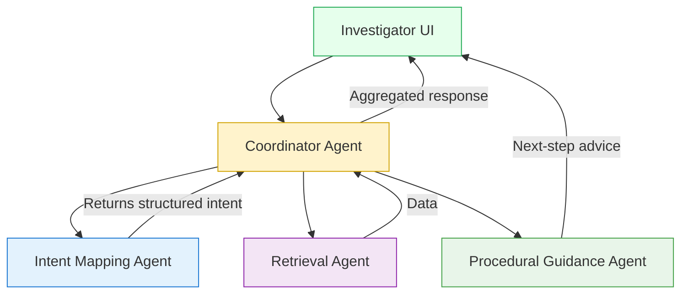
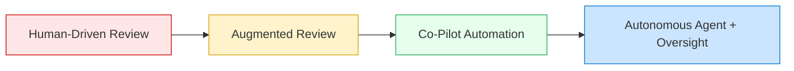
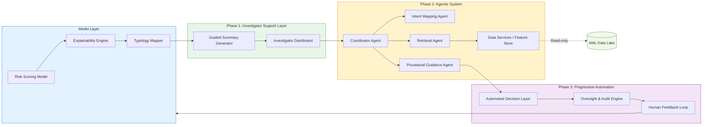

# 🎯 Agentic Compliance Architecture — From Assisted Review to Full Automation

---

### 🟦 **Phase 1 — Investigator Support Layer**

**Goal:** Empower L2 reviewers with explainable insights

**Main Components**

- 🧠 Model Explainability Service → pulls SHAP / feature importance
- 🧩 Typology Mapper → maps features to human red flags & typologies
- 💬 Guided Summary Generator → produces top-reasons and next steps

**Data Flow**



**Key Outcome:**

Investigators instantly see *why* an alert is risky, mapped to familiar AML typologies.

---

### 🟩 **Phase 2 — Agentic System (Assisted Investigation)**

**Goal:** Enable natural-language interaction and automated data retrieval

**Specialized Agents**

- 🧭 **Coordinator Agent** — orchestrates the workflow
- 🤖 **Intent Mapping Agent** — understands queries and maps to features (API or column names)
- 📦 **Retrieval Agent** — executes fast data lookups via tool registry
- 🧩 **Procedural Guidance Agent** — provides contextual next-step advice

**Agentic Flow**



**UX Example:**

> Investigator: “Show me all transactions for this customer in the last 7 days.”
> 
> 
> Agentic system → maps query → retrieves data → suggests related checks.
> 

---

### 🟨 **Phase 3 — Progressive Automation**

**Goal:** Evolve from assisted review to autonomous decision execution

**Stages**

1. **Augmented Review:** Agent explains model output; investigator confirms actions.
2. **Partial Automation:** Agent prepares SAR drafts and supporting evidence.
3. **Full Automation with Oversight:** Agent executes low-risk workflows; humans validate edge cases.

**Evolution Diagram**



---

### ⚙️ **Integration & Infrastructure Layer**

```mermaid
flowchart TB
    FS[Feature Store / Data Lake] --> API[API Gateway & Retrieval Tools]
    API --> LLM[Agentic Services (Coordinator + Specialized Agents)]
    LLM --> AUDIT[Secure Audit Trail & Logging]
    AUDIT --> FEEDBACK[Human Feedback Loop]
    style FS fill:#E3F2FD,stroke:#1976D2
    style API fill:#FFF3CC,stroke:#D1A200
    style LLM fill:#F3E5F5,stroke:#8E24AA
    style AUDIT fill:#E8F5E9,stroke:#43A047
    style FEEDBACK fill:#E6FFEC,stroke:#22AA55

```

---

### 🌍 **End-to-End System Overview**



---

### 📊 **Key Benefits**

| Dimension | Before | After |
| --- | --- | --- |
| Explainability | Static PDFs & scores | Interactive reasoning & typology mapping |
| Investigator Speed | Manual queries | Instant retrieval via agent chat |
| Consistency | Reviewer-dependent | Policy-driven guidance |
| Scalability | Limited human bandwidth | Semi-/Fully automated agent loop |

---

### 🚀 **Implementation Roadmap**

1. Define red-flag → typology mapping dictionary
2. Deploy Explainability API for existing models
3. Build Intent Mapping Agent (RAG + feature catalog)
4. Implement Retrieval Agent with limited tool set
5. Add Procedural Guidance Agent + UI integration
6. Collect investigator feedback → fine-tune prompts
7. Phase-in progressive automation & governance